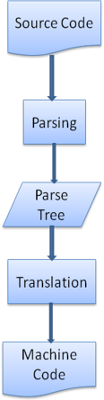

# 浏览器原理

## https://www.html5rocks.com/zh/tutorials/internals/howbrowserswork/

## 浏览器的主要功能

1. 浏览器的主要功能就是向服务器发出请求，在浏览器窗口中展示您选择的网络资源。
    - 资源一般是指 HTML 文档，也可以是 PDF、图片或其他的类型
    - 资源的位置由用户使用 URI（统一资源标示符）指定

## 浏览器的高层结构

1. **用户界面** - 包括地址栏、前进/后退按钮、书签菜单等。除了浏览器主窗口显示的您请求的页面外，其他显示的各个部分都属于用户界面。
2. **浏览器引擎** - 在用户界面和呈现引擎之间传送指令。
3. **呈现引擎** - 负责显示请求的内容。如果请求的内容是 HTML，它就负责解析 HTML 和 CSS 内容，并将解析后的内容显示在屏幕上。
4. **网络** - 用于网络调用，比如 HTTP 请求。其接口与平台无关，并为所有平台提供底层实现。
   用户界面后端 - 用于绘制基本的窗口小部件，比如组合框和窗口。其公开了与平台无关的通用接口，而在底层使用操作系统的用户界面方法。
5. **JavaScript 解释器**。用于解析和执行 JavaScript 代码。
6. **数据存储**。这是持久层。浏览器需要在硬盘上保存各种数据，例如 Cookie。新的 HTML 规范 (HTML5) 定义了“网络数据库”，这是一个完整（但是轻便）的浏览器内数据库。

⚠️`和大多数浏览器不同，Chrome 浏览器的每个标签页都分别对应一个呈现引擎实例。每个标签页都是一个独立的进程。`

## 呈现引擎

> 呈现引擎的作用自然是呈现，也就是在浏览器的屏幕上显示请求的内容。默认情况下，呈现引擎可显示 HTML 和 XML 文档与图片，`主要用途：显示使用 CSS 格式化的 HTML 内容和图片。`

### 内核

1. Gecko
    - Mozilla 公司“自制”的呈现引擎
    - Firefox
2. WebKit
    - 开源代码呈现引擎，起初用于 Linux 平台，随后由 Apple 公司进行修改，从而支持苹果机和 Windows
    - Safari，Chrome

### 主流程

> 呈现引擎一开始会从网络层获取请求文档的内容，内容的大小一般限制在 8000 个块以内。

#### 然后进行如下所示的基本流程

1. 呈现引擎将开始解析 HTML 文档，并将各标记逐个转化成“内容树”上的 DOM 节点。同时也会解析外部 CSS 文件以及样式元素中的样式数据。HTML 中这些带有视觉指令的样式信息将用于创建另一个树结构：呈现树。
2. 呈现树包含多个带有视觉属性（如颜色和尺寸）的矩形。这些矩形的排列顺序就是它们将在屏幕上显示的顺序。
3. 呈现树构建完毕之后，进入“布局”处理阶段，也就是为每个节点分配一个应出现在屏幕上的确切坐标。下一个阶段是绘制 - 呈现引擎会遍历呈现树，由用户界面后端层将每个节点绘制出来。
4. 这是一个渐进的过程。为达到更好的用户体验，呈现引擎会力求尽快将内容显示在屏幕上。它不必等到整个 HTML 文档解析完毕之后，就会开始构建呈现树和设置布局。在不断接收和处理来自网络的其余内容的同时，呈现引擎会将部分内容解析并显示出来。

#### 主流程示例

1. Webkit 主流程

    

2. Gecko 主流程

    

> Gecko 将视觉格式化元素组成的树称为“框架树”。每个元素都是一个框架。WebKit 使用的术语是“呈现树”，它由“呈现对象”组成。对于元素的放置，WebKit 使用的术语是“布局”，而 Gecko 称之为“重排”。对于连接 DOM 节点和可视化信息从而创建呈现树的过程，WebKit 使用的术语是“附加”。有一个细微的非语义差别，就是 Gecko 在 HTML 与 DOM 树之间还有一个称为“内容槽”的层，用于生成 DOM 元素。我们会逐一论述流程中的每一部分：

## 解析 - 综述

> 解析是呈现引擎中非常重要的一个环节

1. 解析文档是指将文档转化成为有意义的结构，也就是可让代码理解和使用的结构
2. 解析得到的结果通常是代表了文档结构的节点树，它称作`解析树或者语法树`

示例 - 解析 2 + 3 - 1 这个表达式，会返回下面的树:

## 语法

> 解析是以文档所遵循的语法规则（编写文档所用的语言或格式）为基础的。所有可以解析的格式都必须对应确定的语法（由词汇和语法规则构成）。这称为与上下文无关的语法。

## 解析器和词法分析器的组合

1. 解析的过程可以分成两个子过程：词法分析和语法分析。
    - 词法分析是将输入内容分割成大量标记的过程。标记是语言中的词汇，即构成内容的单位。在人类语言中，它相当于语言字典中的单词。
    - 语法分析是应用语言的语法规则的过程。
2. 解析器通常将解析工作分给以下两个组件来处理

    - 词法分析器(有时也称为标记生成器): 负责将输入内容分解成一个个有效标记,词法分析器知道如何将无关的字符（比如空格和换行符）分离出来。
    - 解析器: 负责根据语言的语法规则分析文档的结构，从而构建解析树。

    

    - 解析是一个迭代的过程。通常，解析器会向词法分析器请求一个新标记，并尝试将其与某条语法规则进行匹配。如果发现了匹配规则，解析器会将一个对应于该标记的节点添加到解析树中，然后继续请求下一个标记。
    - 如果没有规则可以匹配，解析器就会将标记存储到内部，并继续请求标记，直至找到可与所有内部存储的标记匹配的规则。如果找不到任何匹配规则，解析器就会引发一个异常。这意味着文档无效，包含语法错误。

## 翻译

1. 很多时候，解析树还不是最终产品。解析通常是在翻译过程中使用的，而翻译是指将输入文档转换成另一种格式。编译就是这样一个例子。编译器可将源代码编译成机器代码，具体过程是首先将源代码解析成解析树，然后将解析树翻译成机器代码文档。

    

## 解析示例

1. 在图 5 中，我们通过一个数学表达式建立了解析树。现在，让我们试着定义一个简单的数学语言，用来演示解析的过程。

2. 词汇：我们用的语言可包含整数、加号和减号。

3. 语法：
    - 构成语言的语法单位是表达式、项和运算符
    - 我们用的语言可以包含任意数量的表达式
    - 表达式的定义是：一个“项”接一个“运算符”，然后再接一个“项”
    - 运算符是加号或减号
    - 项是一个整数或一个表达式

让我们分析一下 2 + 3 - 1。
匹配语法规则的第一个子串是 2，而根据第 5 条语法规则，这是一个项。匹配语法规则的第二个子串是 2 + 3，而根据第 3 条规则（一个项接一个运算符，然后再接一个项），这是一个表达式。下一个匹配项已经到了输入的结束。2 + 3 - 1 是一个表达式，因为我们已经知道 2 + 3 是一个项，这样就符合“一个项接一个运算符，然后再接一个项”的规则。2 + + 不与任何规则匹配，因此是无效的输入。

## 词汇和语法的正式定义

## HTML 解析器
> HTML 解析器的任务是将 HTML 标记解析成解析树。