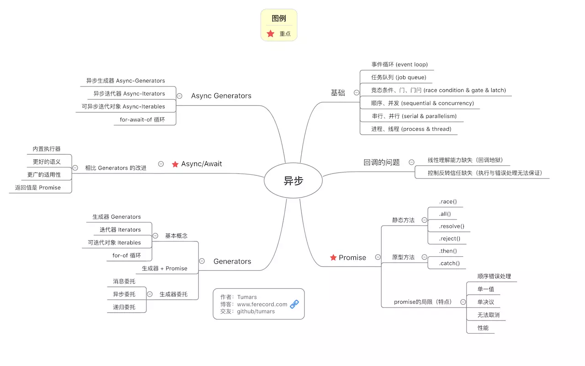

# 异步发展

回调函数
事件监听
发布/订阅
Promise 对象

## 图例



---

## 1. callback 的问题

-   线性理解能力缺失，回调地狱，过深的嵌套，导致回调地狱，难以追踪回调的执行顺序。
-   控制反转信任缺失，错误处理无法保证
    回调函数的调用逻辑是在请求函数内部，我们无法保证回调函数一定会被正确调用。回调本身没有错误处理机制，需要额外设计。可能出现的错误包括：回调返回错误结果、吞掉可能出现的错误与异常、回调没有执行、回调被多次执行、回调被同步执行等等。

---

## 2. 发布订阅

## 3. Promise

---

## 4. Generator

执行 Generator 函数会返回一个遍历器对象，也就是说，Generator 函数除了状态机，还是一个遍历器对象生成函数。返回的遍历器对象，可以依次遍历 Generator 函数内部的每一个状态。

### co

自动执行 Generator

```js
function co(gen) {
    var ctx = this;
    var args = slice.call(arguments, 1);
    return new Promise(function(resolve, reject) {
        if (typeof gen === "function") gen = gen.apply(ctx, args);
        if (!gen || typeof gen.next !== "function") return resolve(gen);

        onFulfilled();

        function onFulfilled(res) {
            var ret;
            try {
                ret = gen.next(res);
            } catch (e) {
                return reject(e);
            }
            next(ret);
        }

        function onRejected(err) {
            var ret;
            try {
                ret = gen.throw(err);
            } catch (e) {
                return reject(e);
            }
            next(ret);
        }

        function next(ret) {
            if (ret.done) return resolve(ret.value);
            var value = toPromise.call(ctx, ret.value);
            if (value && isPromise(value))
                return value.then(onFulfilled, onRejected);
            return onRejected(
                new TypeError(
                    "You may only yield a function, promise, generator, array, or object, " +
                        'but the following object was passed: "' +
                        String(ret.value) +
                        '"'
                )
            );
        }
    });
}
```

1. co 接受一个 Generator 函数作为参数，返回一个 Promise
2. 在返回的 Promise 中，首先检查 gen 是否为 Generator 函数，如果是就执行，返回一个遍历器对象。如果不是，修改 Promise 状态为 resolve(gen),然后结束
3. co 将 Generator 函数的内部指针对象的 next 方法，包装成 onFulfilled 函数。这主要是为了能够捕捉抛出的错误。
4. next 方法最为重要，它会反复调用自身，一共四行代码
    1. 检查当前是否为 Generator 函数的最后一步，如果是就返回 resolve
    2. 保证每一步的值都是 Promise 对象，不是的化就包装成 Promise
    3. 使用 value 的 then 方法，为返回值加上回调行数，通过 onFulfilled 函数再次调用 next 函数
    4. 在参数不符合要求的情况下（参数非 Thunk 函数和 Promise 对象），将 Promise 对象的状态改为 rejected，从而终止执行。

## 5. async/await
