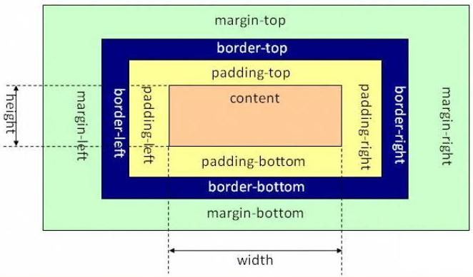
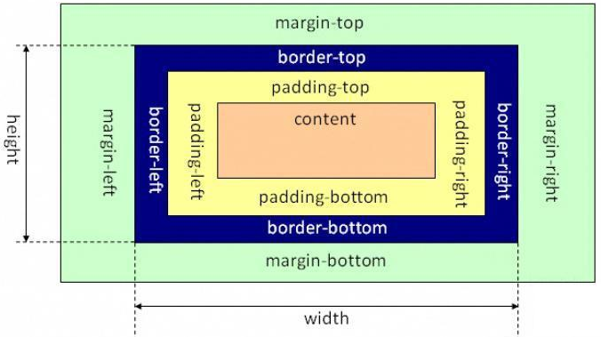

# css

## CSS 基础框盒模型(CSS basic box model)

> 当对一个文档进行布局（lay out）的时候，浏览器的渲染引擎会根据标准之一的 CSS 基础框盒模型（CSS basic box model），将所有元素表示为一个个矩形的盒子（box）。CSS 决定这些盒子的大小、位置以及属性（例如颜色、背景、边框尺寸…）。


1. 每个盒子有四个边界

    - 内容边界 Content edge、内边距边界 Padding Edge、边框边界 Border Edge、外边框边界 Margin Edge。
    - box-sizing
    - ⚠️ `除可替换元素外，对于行内元素来说，尽管内容周围存在内边距与边框，但其占用空间（每一行文字的高度）则由 line-height 属性决定，即使边框和内边距仍会显示在内容周围。`

2. 标准盒模型

    - 在标准模式下，一个块的总宽度= width + margin(左右) + padding(左右) + border(左右)

        

3. IE 盒模型

    - 在怪异模式下，一个块的总宽度= width + margin(左右)（即 width 已经包含了 padding 和 border 值）

        

4. box-sizing 规定如何计算一个元素的总宽度和总高度。元素默认为 content-box

    - content-box 标准盒模型，width,height 只包含内容的 width,heght,最后看到的 width，height 都会另外加上 padding,border
        - width = 内容的宽度 + padding + border
        - height = 内容的高度 + padding + border
    - border-box 怪异盒模型，width,height 包含 content,padding,border
        - width = border + padding + 内容的宽度
        - height = border + padding + 内容的高度

## 视觉格式化模型(visual formatting model)

1. 是用来处理和在视觉媒体上显示文档时使用的计算规则。该模型是 CSS 的基础概念之一。
2. 视觉格式化模型会根据 CSS 盒子模型将文档中的元素转换为一个个盒子，每个盒子的布局由以下因素决定：
    - 盒子的尺寸：精确指定、由约束条件指定或没有指定
    - 盒子的类型：行内盒子（inline）、行内级盒子（inline-level）、原子行内级盒子（atomic inline-level）、块盒子（block）
    - 定位方案（positioning scheme）：普通流定位、浮动定位或绝对定位
    - 文档树中的其它元素：即当前盒子的子元素或兄弟元素
    - 视口尺寸与位置
    - 所包含的图片的尺寸
    - 其他的某些外部因素
3. 该模型会根据盒子的包含块（containing block）的边界来渲染盒子。通常，盒子会创建一个包含其后代元素的包含块，但是盒子并不由包含块所限制，当盒子的布局跑到包含块的外面时称为溢出（overflow）。

4. 名词解释

    - 块：block，一个抽象的概念，一个块在文档流上占据一个独立的区域，块与块之间在垂直方向上按照顺序依次堆叠。
    - 包含块：containing block，包含其他盒子的块称为包含块。
    - 盒子：box，一个抽象的概念，由 CSS 引擎根据文档中的内容所创建，主要用于文档元素的定位、布局和格式化等用途。盒子与元素并不是一一对应的，有时多个元素会合并生成一个盒子，有时一个元素会生成多个盒子（如匿名盒子）。
    - 块级元素：block-level element，元素的 display 为 block、list-item、table 时，该元素将成为块级元素。元素是否是块级元素仅是元素本身的属性，并不直接用于格式化上下文的创建或布局。
    - 块级盒子：block-level box，由块级元素生成。一个块级元素至少会生成一个块级盒子，但也有可能生成多个（例如列表项元素）。
    - 块盒子：block box，如果一个块级盒子同时也是一个块容器盒子（见下），则称其为块盒子。除具名块盒子之外，还有一类块盒子是匿名的，称为匿名块盒子（Anonymous block box），匿名盒子无法被 CSS 选择符选中。
    - 块容器盒子：block container box 或 block containing box，块容器盒子侧重于当前盒子作为“容器”的这一角色，它不参与当前块的布局和定位，它所描述的仅仅是当前盒子与其后代之间的关系。换句话说，块容器盒子主要用于确定其子元素的定位、布局等。
    - ⚠️ 盒子分为“块盒子”和“块级盒子”两种，但元素只有“块级元素”，而没有“块元素”。下面的“行内级元素”也是一样。

    - 行内级元素：inline-level element，display 为 inline、inline-block、inline-table 的元素称为行内级元素。与块级元素一样，元素是否是行内级元素仅是元素本身的属性，并不直接用于格式化上下文的创建或布局。
    - 行内级盒子：inline-level box，由行内级元素生成。行内级盒子包括行内盒子和原子行内级盒子两种，区别在于该盒子是否参与行内格式化上下文的创建。
    - 行内盒子：inline box，参与行内格式化上下文创建的行内级盒子称为行内盒子。与块盒子类似，行内盒子也分为具名行内盒子和匿名行内盒子（anonymous inline box）两种。
    - 原子行内级盒子：atomic inline-level box，不参与行内格式化上下文创建的行内级盒子。原子行内级盒子一开始叫做原子行内盒子（atomic inline box），后被修正。原子行内级盒子的内容不会拆分成多行显示。

5. 盒子的生成
    > 盒子的生成是 CSS 视觉格式化模型的一部分，用于从文档元素生成盒子。盒子有不同的类型，不同类型的盒子的格式化方法也有所不同。盒子的类型取决于 CSS display 属性。

## 块格式化上下文（Block Formatting Context，BFC）

1. BFC 是什么

    > BFC 全称为块级格式化上下文 (Block Formatting Context) 。BFC 是 W3C CSS 2.1 规范中的一个概念，它决定了元素如何对其内容进行定位以及与其他元素的关系和相互作用，当涉及到可视化布局的时候，Block Formatting Context 提供了一个环境，HTML 元素在这个环境中按照一定规则进行布局。该环境中的元素不会影响到其它环境中的布局。可以说 BFC 就是一个作用范围，把它理解成是一个独立的容器，并且这个容器里 box 的布局与这个容器外的 box 毫不相干。

2. 出发 BFC 的条件

    - 根元素(html)
    - 浮动元素（元素的 float 不是 none）
    - 绝对定位元素（元素的 position 为 absolute 或 fixed）
    - 行内块元素（元素的 display 为 inline-block）
    - 表格单元格（元素的 display 为 table-cell，HTML 表格单元格默认为该值）
    - 表格标题（元素的 display 为 table-caption，HTML 表格标题默认为该值）
    - 匿名表格单元格元素（元素的 display 为 table、table-row、 table-row-group、table-header-group、table-footer-group（分别是 HTML table、row、 - tbody、thead、tfoot 的默认属性）或 inline-table）
    - overflow 值不为 visible 的块元素
    - display 值为 flow-root 的元素
    - contain 值为 layout、content 或 paint 的元素
    - 弹性元素（display 为 flex 或 inline-flex 元素的直接子元素）
    - 网格元素（display 为 grid 或 inline-grid 元素的直接子元素）
    - 多列容器（元素的 column-count 或 column-width 不为 auto，包括 column-count 为 1）
    - column-span 为 all 的元素始终会创建一个新的 BFC，即使该元素没有包裹在一个多列容器中（标准变更，Chrome bug）。

3. BFC 的约束规则

    - 内部的盒会在垂直方向一个接一个排列（可以看作 BFC 中有一个的常规流）
    - 处于同一个 BFC 中的元素相互影响，可能会发生外边距重叠
    - 每个元素的 margin box 的左边，与容器块 border box 的左边相接触(对于从左往右的格式化，否则相反)，即使存在浮动也是如此
    - BFC 就是页面上的一个隔离的独立容器，容器里面的子元素不会影响到外面的元素，反之亦然
    - 计算 BFC 的高度时，考虑 BFC 所包含的所有元素，连浮动元素也参与计算
    - 浮动盒区域不叠加到 BFC 上

4. BFC 的作用
    - 解决外边距塌陷
    - 浮动问题
    - 自适用两列布局（float + overflow）

## position

> CSS position 属性用于指定一个元素在文档中的定位方式。top，right，bottom 和 left 属性则决定了该元素的最终位置。

1. static
    - static 是 position 属性的默认值。如果省略 position 属性，浏览器就认为该元素是 static 定位。
2. relative

    - 不脱离文档流
    - relative 表示，相对于默认位置（即 static 时的位置）进行偏移，即定位基点是元素的默认位置。

        

3. fixed

    - 脱离文档流
    - 定位基点是浏览器窗口，这会导致元素的位置不随页面滚动而变化，好像固定在网页上一样。

        

4. absolute

    - 绝对定位元素脱离文档流
    - 绝对定位元素相对于最近的非 static 祖先元素定位。当这样的祖先元素不存在时，则相对于 ICB（inital container block, 初始包含块）
    - ⚠️ 定位基点，不能是 static 定位，否则定位基点就会变成整个网页的根元素 html。

        

5. sticky
    - 不脱离文档流
    - 相对它的最近滚动祖先（nearest scrolling ancestor）和 containing block (最近块级祖先 nearest block-level ancestor)，包括 table-related 元素，基于 top, right, bottom, 和 left 的值进行偏移。偏移值不会影响任何其他元素的位置。
    - ⚠️sticky 生效的前提是，必须搭配 top、bottom、left、right 这四个属性一起使用，不能省略，否则等同于 relative 定位，不产生"动态固定"的效果。原因是这四个属性用来定义"偏移距离"，浏览器把它当作 sticky 的生效门槛。

## flex 弹性布局


> 1. Flex 是 Flexible Box 的缩写，意为"弹性布局".
> 2. 采用 Flex 布局的元素，称为 Flex 容器（flex container），简称"容器"。它的所有子元素自动成为容器成员，称为 Flex 项目（flex item），简称"项目"。
> 3. 容器默认存在两根轴：水平的主轴（main axis）和垂直的交叉轴（cross axis）。主轴的开始位置（与边框的交叉点）叫做 main start，结束位置叫做 main end；交叉轴的开始位置叫做 cross start，结束位置叫做 cross end。
> 4. 项目默认沿主轴排列。单个项目占据的主轴空间叫做 main size，占据的交叉轴空间叫做 cross size。

1. 容器属性

    - flex-direction
    - flex-wrap
    - flex-flow
    - justify-content
    - align-items
    - align-content

2. 元素属性

    - order
    - flex-grow
    - flex-shrink
    - flex-basis
    - flex ，flex 属性是 flex-grow, flex-shrink 和 flex-basis 的简写，默认值为 0 1 auto。后两个属性可选。
    - align-self

```js

.item {
  flex: none | [ <'flex-grow'> <'flex-shrink'>? || <'flex-basis'> ]
  // 0 1 auto  默认值， 后两个可选
}

```

## 外边距合并

> 当块级元素（block）的上外边距(margin-top)和下外边距(margin-bottom)同时都有设定时只会只会保留最大边距，这种行为称为边界折叠（margin collapsing），有时也翻译为外边距重叠。

1. 同一层相邻元素之间

    - 底部元素设置为浮动 float:left;
    - 底部元素的 position 的值为 absolute/fixed
    - 在设置 margin-top/bottom 值时统一设置上或下

2. 没有内容将父元素和后代元素分开

    - 添加边框
    - 添加 padding
    - 添加行内容
    - 创建块级格式化上下文
    - 清除浮动

3. 空的块级元素
4. ⚠️ `注意有设定 float 和 position=absolute 的元素不会产生外边距重叠行为。`

## rem,em,vm,px 之间的区别
