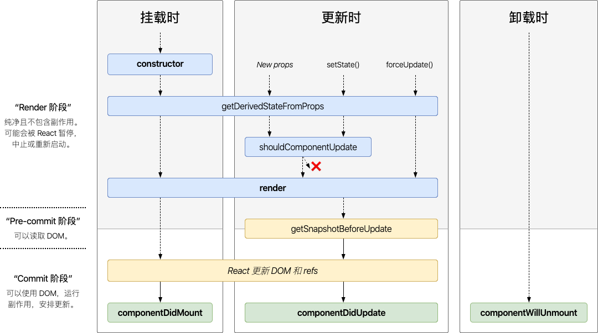

# React

## React 生命周期函数

## 虚拟 DOM

1. 什么是虚拟 DOM
    > 通过使用 js 中的对象模拟 DOM 中的节点，然后再通过特定的 render 方法，将其渲染成真正的 DOM 节点
2. 虚拟 DOM 的好处
    >

## Dom diff

> 通过 js 层面的计算，返回一个 path 对象，即补丁对象，再通过特定的操作解析 path 对象，完成页面的重新渲染

1. 什么是 DOM diff

    - DOM 节点的跨层级已动工操作特别少，可以忽略不记
    - 拥有相同类的两个组件会生成相似的树形结构，拥有不同类的两个组件将会生成不同的树形结构
    - 对于同一层级的一组节点，他们可以通过唯一的 key 进行区分，开发人员可以使用一个 key 指示在不同的渲染中那个哪些元素可以保持稳定
